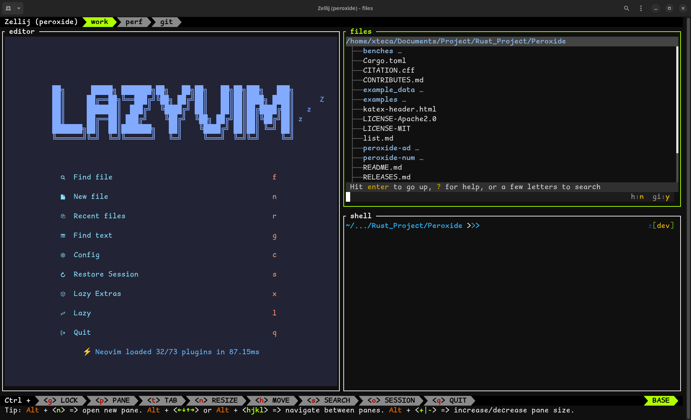

# ZelLayGen (Zellij Layout Generator)

<p style="text-align: center;">

</p>

Easy to generate `layout.kdl` for [Zellij](https://zellij.dev)

## Prerequisites

- Rust
- Cargo

## Usage

1. Copy `config_template.toml` to `config.toml`
2. Edit `config.toml`
    - `name` : Name of session & kdl file - `{name}.kdl`
    - `dir` : Directory to your project dir - `~/path/to/project`
    - `editor_cmd` : Editor open dir command (e.g. `nvim`, `code .` and etc.)
    - `tree_tool` : Tool for file tree view (e.g. `broot`)
    - `monitor_tool` : Tool for monitor (e.g. `htop`, `btm`, `btop`, `ytop` and etc.)
    - `git_tool` : Tool for git (e.g. `lazygit`, `gitui` and etc.)
3. Run via Cargo
    ```sh
    cargo run --release
    ```
4. Check generated `{name}.kdl`

## Example

Generated kdl file from default `config_template.toml` is as follow.

```kdl
layout {
    default_tab_template {
        pane size=1 borderless=true {
            plugin location="zellij:tab-bar"
        }
        children
        pane size=2 borderless=true {
            plugin location="zellij:status-bar"
        }
    }
    tab name="work" focus=true split_direction="Vertical" {
        pane split_direction="Vertical" {
            pane name="editor" command="/usr/bin/zsh" focus=true {
                args "-c" "cd ~/path/to/project && nvim"
            }
            pane split_direction="Horizontal" {
                pane name="files" command="/usr/bin/zsh" {
                    args "-c" "cd ~/path/to/project && broot"
                }
                pane name="shell" command="/usr/bin/zsh" {
                    args "-c" "cd ~/path/to/project && /usr/bin/zsh"
                }
            }
        }
    }
    tab name="perf" {
        pane name="monitor" command="btm"
    }
    tab name="git" {
        pane name="git" {
            command "/usr/bin/zsh"
            args "-c" "cd ~/path/to/project && lazygit"
        }
    }
}
session_name "test"
attach_to_session true
```
